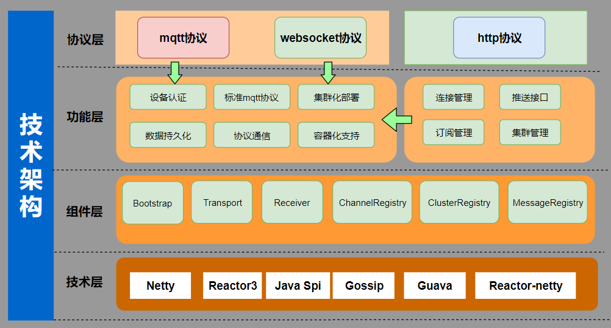

## 平台简介
## SMQTT是一款开源的MQTT消息代理Broker，

SMQTT基于Netty开发，底层采用Reactor3反应堆模型,支持单机部署，支持容器化部署，具备低延迟，高吞吐量，支持百万TCP连接，同时支持多种协议交互，是一款非常优秀的消息中间件！

* 采用前后端分离的模式，微服务版本前端( [smqtt-Vue](https://github.com/quickmsg/smqtt-ui))。
* 后端采用Spring Boot、Spring Cloud & Alibaba。
* 注册中心、配置中心选型Nacos，权限认证使用Redis。
* 流量控制框架选型Sentinel。



## 系统模块

~~~
com.smqtt     
├── smqtt-ui              // 前端框架 
├── smqtt-gateway         // 网关模块 
├── smqtt-auth            // 认证中心 
├── smqtt-api             // 接口模块
│       └── smqtt-api-system                          // 系统接口
├── smqtt-common          // 通用模块
│       └── smqtt-common-core                         // 核心模块
│       └── smqtt-common-datascope                    // 权限范围
│       └── smqtt-common-datasource                   // 多数据源
│       └── smqtt-common-log                          // 日志记录
│       └── smqtt-common-redis                        // 缓存服务
│       └── smqtt-common-security                     // 安全模块
│       └── smqtt-common-swagger                      // 系统接口
│       └── smqtt-common-broker                    // smqttBroker
├── smqtt-modules         // 业务模块
│       └── smqtt-system                              // 系统模块 
│       └── smqtt-gen                                 // 代码生成 
│       └── smqtt-job                                 // 定时任务 
│       └── smqtt-function                             // 功能模块 
│       └── smqtt-file                                // 文件服务 
├── smqtt-visual          // 图形化管理模块
│       └── smqtt-visual-monitor                      // 监控中心 
├──pom.xml                // 公共依赖
~~~

## 架构图


## 内置功能

1.  用户管理：用户是系统操作者，该功能主要完成系统用户配置。
2.  部门管理：配置系统组织机构（公司、部门、小组），树结构展现支持数据权限。
3.  岗位管理：配置系统用户所属担任职务。
4.  菜单管理：配置系统菜单，操作权限，按钮权限标识等。
5.  角色管理：角色菜单权限分配、设置角色按机构进行数据范围权限划分。
6.  字典管理：对系统中经常使用的一些较为固定的数据进行维护。
7.  参数管理：对系统动态配置常用参数。
8.  通知公告：系统通知公告信息发布维护。
9.  操作日志：系统正常操作日志记录和查询；系统异常信息日志记录和查询。
10. 登录日志：系统登录日志记录查询包含登录异常。
11. 在线用户：当前系统中活跃用户状态监控。
12. 定时任务：在线（添加、修改、删除)任务调度包含执行结果日志。
13. 代码生成：前后端代码的生成（java、html、xml、sql）支持CRUD下载 。
14. 系统接口：根据业务代码自动生成相关的api接口文档。
15. 服务监控：监视当前系统CPU、内存、磁盘、堆栈等相关信息。
16. 在线构建器：拖动表单元素生成相应的HTML代码。
17. 连接池监视：监视当前系统数据库连接池状态，可进行分析SQL找出系统性能瓶颈。

## smqtt目前拥有的功能如下：

1.  消息质量等级实现(支持qos0，qos1，qos2)
2.  会话消息
3.  保留消息
4.  遗嘱消息
5.  客户端认证
6.  tls加密
7.  websocket协议支持
8.  http协议交互
9.  SPI接口扩展支持
    - 消息管理接口（会话消息/保留消息管理）
    - 通道管理接口 (管理系统的客户端连接)
    - 认证接口 （用于自定义外部认证）
    - 拦截器  （用户自定义拦截消息）
10. 集群支持（gossip协议实现）
11. 容器化支持 


## 后面规划项目

1. 规则引擎
2. Web管理系统集成监控系统
3. 客户端管理
4. 多协议组件桥接agent（用户其他协议与broker之间交互）


## main方式启动

引入依赖
```markdown
<dependency>
  <groupId>io.github.quickmsg</groupId>
  <artifactId>smqtt-core</artifactId>
  <version>1.0.4</version>
</dependency>

```

阻塞式启动服务：

```markdown

 Bootstrap.builder()
       .port(8555)
       .websocketPort(8999)
       .options(channelOptionMap -> {})
       .ssl(false)
       .reactivePasswordAuth((U,P)->true)
       .sslContext(new SslContext("crt","key"))
       .isWebsocket(true)
       .wiretap(false)
       .httpOptions(Bootstrap.HttpOptions.builder().ssl(false).httpPort(62212).accessLog(true).build())
       .build()
       .startAwait();

```

非阻塞式启动服务：

```markdown

 
 Bootstrap bootstrap = 
        Bootstrap.builder()
       .port(8555)
       .websocketPort(8999)
       .options(channelOptionMap -> {})
       .ssl(false)
       .sslContext(new SslContext("crt","key"))
       .isWebsocket(true)
       .wiretap(false)
       .httpOptions(Bootstrap.HttpOptions.builder().ssl(false).httpPort(62212).accessLog(true).build())
       .build()
       .start().block();

assert bootstrap != null;
 // 关闭服务
 bootstrap.shutdown();

```


## jar方式


1. 下载源码 mvn compile package -P jar

```markdown
  在smqtt-bootstrap/target目录下生成jar
```

2. 准备配置文件 config.properties

```markdown
    
    # 开启tcp端口
    smqtt.tcp.port=1883
    # 高水位
    smqtt.tcp.lowWaterMark=4000000
    # 低水位
    smqtt.tcp.highWaterMark=80000000
    # 开启ssl加密
    smqtt.tcp.ssl=false
    # 证书crt smqtt.tcp.ssl.crt =
    # 证书key smqtt.tcp.ssl.key =
    # 开启日志
    smqtt.tcp.wiretap=false
    # boss线程
    smqtt.tcp.bossThreadSize=4;
    # work线程
    smqtt.tcp.workThreadSize=8;
    # websocket端口
    smqtt.websocket.port=8999;
    # websocket开启
    smqtt.websocket.enable=true;
    # smqtt用户
    smqtt.tcp.username=smqtt;
    # smqtt密码
    smqtt.tcp.password=smqtt;
    # 开启http
    smqtt.http.enable=true;
    # 开启http端口
    smqtt.http.port=1999;
    # 开启http日志
    smqtt.http.accesslog=true;
    # 开启ssl
    smqtt.http.ssl.enable=false;
    # smqtt.http.ssl.crt =;
    # smqtt.http.ssl.key;
  ```

3. 启动服务

```markdown
  java -jar smqtt-bootstrap-1.0.1-SNAPSHOT.jar <conf.properties路径>
```


## docker 方式


拉取镜像

``` 
# 拉取docker镜像地址
docker pull 1ssqq1lxr/smqtt:latest
```

启动镜像默认配置

``` 
# 启动服务
docker run -it  -p 1883:1883 1ssqq1lxr/smqtt
```

启动镜像使用自定义配置（ 准备配置文件conf.properties）


``` 
# 启动服务
docker run -it  -v <配置文件路径目录>:/conf -p 1883:1883  -p 1999:1999 1ssqq1lxr/smqtt
```


## 测试服务（启动http端口）

- 启动客户端订阅主题 test/+

- 使用http接口推送mqtt消息

``` 
# 推送消息
curl -H "Content-Type: application/json" -X POST -d '{"topic": "test/teus", "qos":2, "retain":true, "message":"我来测试保留消息3" }' "http://localhost:1999/smqtt/publish"
```


## wiki地址

集群类配置参考文档:

[smqtt文档](https://doc.smqtt.cc/)


## License

[Apache License, Version 2.0](LICENSE)


## 麻烦关注下公众号！


- 添加微信号`Lemon877164954`，拉入smqtt官方交流群
- 加入qq群 `700152283` 


